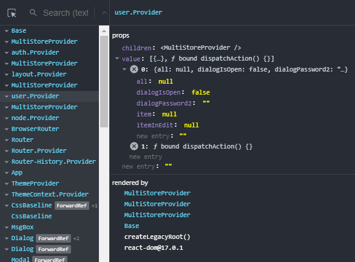

  
[Jon](https://github.com/priolo/jon)

## INDEX
- [Quick start](#quick-start)  
		- [Installation](#installation)  
		- [Create STORE](#create-store)  
		- [Create PROVIDER](#create-provider)  
		- [Use STORE](#use-store)  
- [Why](#why)
- [Production ready?](#production-ready)
- [Examples](#examples)
- [API](#api)
	- [MultiStoreProvider](#multistoreprovider)
	- [getStore( storeName:string ):store](#getstore-storenamestring-store)
	- [useStore( storeName:string ):store](#usestore-storenamestring-store)
	- [STORE SETUP JSON](#store-setup-json)
	- [state](#state)
	- [getters](#getters)
	- [mutators](#mutators)
	- [actions](#actions)
- [TIPS](#tips)


# Quick start

### Installation

`npm install @priolo/jon`

### Create STORE and PROVIDER
`my_app/index.js`
```jsx
import ReactDOM from "react-dom";
import App from "./App";


import { MultiStoreProvider } from '@priolo/jon';

// SETUP of STORE
const mySetup = {
	state: {
		value: "init value"
	},
	getters: {
		getUppercase: (state) => state.value.toUpperCase()
	},
	actions: {
		addAtEnd: (state, char, store) => {
			store.setValue(state.value + char)
		}
	},
	mutators: {
		setValue: (state, value) => ({value})
	}
}


// APP creation with PROVIDER
ReactDOM.render(
	<MultiStoreProvider setups={{myStore:mySetup}}>
		<App />
	</MultiStoreProvider>,
	document.getElementById("root")
);
```

### Use STORE
`my_app/App.js`
```jsx
import { useStore } from "@priolo/jon";
import React from "react";

export default function App() {

  const { state, setValue, getUppercase } = useStore("myStore")

  return (<div>
	<h1>{state.value}</h1><h2>{getUppercase()}</h2>
	<input 
		value={state.value} 
		onChange={(e)=>setValue(e.target.value)} 
	/>
  </div>);
}
```

[sandbox](https://codesandbox.io/s/example-1-5d2tt)


# Why
How why??!  
You want to pass component data to component  
until what complexity will be unmanageable??? NO!  
JON is designed to be VERY LIGHT and integrated with React.  
Basically it is a utility to use native [PROVIDERS](https://it.reactjs.org/docs/hooks-reference.html#usecontext), [Take a look!](https://github.com/priolo/jon/blob/develop/src/lib/store/rvxProviders.jsx)... and this is all


# Production Ready?
mmm... "JON" is not a used library.  
I don't know a lot of use cases!  
I can tell you that I use it in three medium-sized professional projects (CRA and NEXT).  
Furthermore JON is a VERY LIGHT lib.  
You can always replace it on the fly with React's "native" PROVIDERS.   
This is an example: [sandbox](https://codesandbox.io/s/react-template-ln4gh?file=/index.js)
>You can use a series of "Providers" instead of "MultiStoreProvider"  
>and share the "reducer"


# Examples

- [basic](https://codesandbox.io/s/example-1-5d2tt)
- [multi stores](https://codesandbox.io/s/example-2-iz6l7)
- [action](https://codesandbox.io/s/example-3-hw6hs)
- [material-ui](https://codesandbox.io/s/example-4-0jeqi)


# API

## MultiStoreProvider
REACT PROVIDER that contains all REDUCERS  
[code](https://codesandbox.io/s/example-4-0jeqi?file=/index.js:305-351)

## getStore( storeName:string ):store
Returns a STORE by its name
It is useful for using a STORE outside a REACT COMPONENT  
[code](https://codesandbox.io/s/example-4-0jeqi?file=/stores/user.js:159-197)

## useStore( storeName:string ):store
Use a STORE by its name
It is useful for using a STORE in a REACT COMPONENT  
[code](https://codesandbox.io/s/example-4-0jeqi?file=/components/Body.jsx:191-233)

## STORE SETUP JSON
```js
{
	// initial state of STORE
	state: {
		value: "init value",
		...
	},
	// Function called once. Used to initialize the store. 
	// For example if I have to listen to an event 
	init: (store) => {
		...
	},
	// returns a value
	getters: {
		getUppercase: (state, payload, store) => state.value.toUpperCase(),
		...
	},
	// performs an action. It can be asynchronous
	actions: {
		fetch: async (state, payload, store) => {
			const {response} = await ajax.get(`my_server`)
			store.setValue(response)
		},
		...
	},
	// allows you to change the STATUS
	// must return a key-value object
	// this object will be merged to STATE
	mutators: {
		setValue: (state, value, store) => ({ value }),
		...
	},
	// Intercepts when a "mutator" is called
	watch: {
		"otherStore": {
			// store: THIS store
			// value: the new value passed to the "mutator"
			"setValue": ( store, value ) => {
				// code
			}
		}
	}
	
}
```

---

## state 

*The initial STATE of the STORE. "Single Source of Truth"*  
The STATE is connected to the VIEW (via React):  
When the STATE changes then the VIEW updates automatically.
  
To access the STATE of a STORE:

```js
const { state } = useStore("MyStore")
```

Avoid conflicts:
```js
const { state:mystore1 } = useStore("MyStore1")
const { state:mystore2 } = useStore("MyStore2")
```

Outside the "React Hooks":
```js
const { state:mystore } = getStore("MyStore")
```

Then:
```html
<div>{mystore.value}</div>
```

---

## getters

*Returns a value of the STATE.*  
Although you can access the STATE directly  
in many cases you will want some processed data.   

For example: a filtered list:  

```js
const myStore = {
   state: { 
	   users:[...] 
	   }, 
   getters: {
      getUsers: ( state, payload, store ) 
         => state.users.filter(user=>user.name.includes(payload)),
   }
}
```

```jsx
function MyComponent() {
   const { getUsers } = useStore("myStore")
   return getUsers("pi").map ( user => <div>{user.name}</div>)
}
```

The signature of a **getter** is:
- **state**: the current value of the STATE
- **payload**: (optional) the parameter passed to the getter when it is called
- **store**: the STORE object itself. You can use it as if it were "this"

> GETTERS should ONLY "contain" STATE and GETTERS

---

## mutators

*The only way to change the STATE.*  
It accepts a parameter and returns the "part" of STORE to be modified.

For example:

```js
const myStore = {
   state: { 
	   value1: 10,
	   value2: "topolino",
	}, 
   mutators: {
      setValue1: ( state, value1, store ) => ({ value1 }),
	  // ! verbose !
	  setValue2: ( state, value, store ) => { 
		  const newValue = value.toUpperCase()
		  return {
			  value2: newValue
		  }
	  },
   }
}
```

```jsx
function MyComponent() {
    const { state, setValue1 } = useStore("myStore")
    return <button onClick={e=>setValue1(state.value1+1)}>
        value1: {state.value1}
    </button>
}
```

the signature of a **mutator** is:
- **state**: the current value of the STATE
- **payload**: (optional) the parameter passed to the mutator when it is called
- **store**: the STORE object itself. You can use it as if it were "this"

> Inside MUTATORS you should use ONLY the STATE.

---

## actions

*Contains the business logic*  
ACTIONS can be connected to SERVICEs and APIs  
They can call STATE values, MUTATORS and GETTERS  
They can be connected to other STOREs  
They can be async  

A typical use:

```js
const myStore = {
    state: { 
	    value: null,
	}, 
    actions: {
        fetch: async ( state, _, store ) => {
            const { data } = await fetch ( "http://myapi.com" )
            store.setValue ( data )
        }
    },
    mutators: {
        setValue: ( state, value, store ) => ({ value }),
    }
}
```

```jsx
function MyComponent() {
    const { state, fetch } = useStore("myStore")
    return <button onClick={e=>fetch()}>
        value1: {state.value}
    </button>
}
```

the signature of a **action** is:
- **state**: the current value of the STATE
- **payload**: (optional) the parameter passed to the action when it is called
- **store**: the STORE object itself. You can use it as if it were "this"

---


As you may have noticed: the functions always have the same signature:  
**fn (state, payload, store) => {}**  
parameters:  
- **state**:  
  is the current STATE of the STORE (read only)
- **payload**:  
  any parameter passed to the function (optional)
- **store**:  
  it's the same STORE where the function is (a kind of *this*)

---

# _syncAct

multiple call to action problem:  
If the actions use the same variables  
may not update the STATE correctly ([look here](https://it.reactjs.org/docs/hooks-reference.html#functional-updates))  
In this case use the `_syncAct` function  
[sandbox](https://codesandbox.io/s/example-sync-1-fm05e?file=/src/App.js)

```js
{  
	...
	actions: {
		// NOT WORK: value = 1
		notWork: (state, value, store ) => {
			store.update(1)
			store.update(1)
		},
		// WORK: value = 2
		work: (state, value, store ) => {
			store.update(1)
			store._syncAct(store.update, 1)
		},
		// WORK 3 TIME: value = 3
		work3: async (state, value, store ) => {
			store.update(1)
			await store._syncAct(store.update, 1)
			await store._syncAct(store.update, 1)
		},

		update: (state, step, store) => {
			store.setValue(state.value + step)
		},
	},
	mutators: {
		setValue: (state, value, store) => ({ value }),
	}
}
```


# TIPS

## Improve performance (with MEMO)

This library offers the bare minimum  
For the rest, use the official "react" systems  
To optimize a component that uses STOREs:  
[sandbox](https://codesandbox.io/s/test-render-memo-47rt7?file=/src/Cmp1.jsx:0-515)

```jsx
import React, { useMemo } from "react";
import { useStore } from "@priolo/jon";

export default function Cmp () {

	const { state, setValue } = useStore("myStore")

	return useMemo( ()=>(<div>

		<h1>{state.value}</h1>
	
		<input 
			value={state.value}
			onChange={(e)=>setValue(e.target.value)} 
		/>
		
	</div>)
	,[state.value])
}
```

## Use the "**store**" parameter as if it were "**this**"
You can use the "store" parameter
as the object that contains the getters / action / mutators
in order to refer to them
```js
{
	...
	actions: {
		fetchCropCycles: async (state, farmId, store) => {
			const { data } = await farmApi.index(farmId)
			store.setCrops(data)
		}
	},
	mutators: {
		setCrops: (state, crops) => ({ crops }),
	}
}
```

## Mutate multiple variable
```js
{
	...
	mutators: {
		// change a variable of the STATE (boring)
		setValue: (state, value, store) => ({ value }),
		// changes two variables of the STATE
		setValue12: (state, {value1, value2}, store) => 
			({ value1, value2 }),
		// changes a property of a variable of the STATE
		setSubValue: (state, name, store) => 
			({ user: { ...state.user, name } }),
		// conditional modification of the STATE
		setValueHasChanged: (state, value, store) => 
			({ value: value, valueHasChanged: state.value!=value }),
	}
}
```

## Break a "**store**" into several files
You can use the "mixStores" tool to merge multiple setup-stores.  
To be able to distribute the code on more files  

`/stores/index.js`
```js
import mixStores from "@priolo/jon"
import store2 from "./store2"

const store1 = {
	state: { ... },
	getters: { ... },
	actions: { ... },
	mutators: { ... }
}

export default mixStores(store1, store2)
```
`/stores/store2.js`
```js
const store2 = {
	state: { ... },
	getters: { ... },
	actions: { ... },
	mutators: { ... }
}

export default store2
```

## Using a "**store**" inside another "**store**"
`/stores/layout.js`
```js
export default {
	...
	actions: { 
		dialogOpen: (state, payload, store) => {
			...
		},
	},
}
```
`/stores/store2.js`
```js
import { getStore } from "@priolo/jon"

export default {
	...
	actions: {
		save: (state, payload, store) => {
			const { dialogOpen } = getStore("layout")
			dialogOpen()
		}
	},
}
```

## Using a "**store**" in an external function
`/stores/store2.js`
```js
import { getStore } from "@priolo/jon"

export function async apiIndex () {
	const { state, myAction, myGetter, myMutator } = getStore("myStore")
	// the "actions" can be asynchronous
	// and can return a value
	const {data} = await myAction()
	console.log(state.value)
}
```

## Check a "**store**" from the inspector




## ROADMAP

Al momento questo è un progetto l'ho usato per molti progetti personali.   
E' la libreria estremamente leggera che mi serve per usare React!  
Nell'immediato futuro vorrei realizzare:
- Coinvolgimento della community React
- Possibilità di inserire dei PLUGIN
- Strumenti di debug che permettono test creati automaticamente
