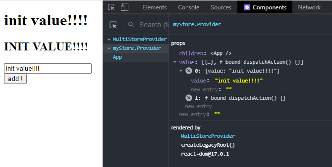

# Announcing: new and light state manager “Jon”

react, javascript, state, design


## Introduction
So I started using the native REACT methods [REDUCER](https://it.reactjs.org/docs/hooks-reference.html#usereducer) and [PROVIDERS](https://it.reactjs.org/docs/hooks-reference.html#usecontext) for state management  
... eventually I ended up with a light lib inspired by [VUEX](https://vuex.vuejs.org/)!  
The great thing about VUEX (or FLUX) is that you have a solid structure:  
The `State` is immutable,  
The `Actions` change the `State`,  
The `View` intercepts the `State` changes and calls the `Actions`.  
Explicitly expressed by a simple object:  

```js
const store = {
    state: { ... },
    getters: { ... },
    actions: { ... },
    mutators: { ... },
}
```

The idea is of a "single source of truth" so I didn't use classes (which if I'm an OOP enthusiast)  
as close as possible to REACT

I was surprised how useful it was in my projects so I decided to "publish" it:  
[Jon](https://github.com/priolo/jon)  
I also made a template:  
[SPA-Template](https://github.com/priolo/jon-template)  

## Simple DEMO

### Installation

`npm install @priolo/jon`

### Create the store:

`my_app/myStore.js`
```jsx
export default {
    state: {
        value: "init value",
    },
    getters: {
        getUppercase: (state) => state.value.toUpperCase(),
    },
    actions: {
        addAtEnd: (state, char, store) => {
            store.setValue(state.value + char)
        }
    },
    mutators: {
        setValue: (state, value) => ({value})
    }
}
```

### Create PROVIDER

`my_app/index.js`
```jsx
import React from "react";
import ReactDOM from "react-dom";
import App from "./App";

import { MultiStoreProvider } from '@priolo/jon';
import myStore from "./myStore"


const rootElement = document.getElementById("root");
ReactDOM.render(
  <MultiStoreProvider setups={{myStore}}>
    <App />
  </MultiStoreProvider>,
  rootElement
);
```

### Use STORE

`my_app/App.js`
```jsx
import { useStore } from "@priolo/jon";
import React from "react";

export default function App() {
  const { state, setValue, addAtEnd, getUppercase } = useStore("myStore")
  const handleClickIncrement = e => addAtEnd("!")

  return (<div>

      <h1>{state.value}</h1><h2>{getUppercase()}</h2>

      <input 
        value={state.value}
        onChange={(e)=>setValue(e.target.value)} 
      />

      <button 
        onClick={handleClickIncrement}
      >add !</button>

  </div>);
}
```
[codesandbox](https://codesandbox.io/s/exe-3-y2ygx)

### Conclusion
The demo is very simple, but I've used Jon on fairly large projects and haven't regretted it.  
Furthermore, they are simple PROVIDERS so for debugging you can use REACT Tool:  
   
Let me know what you think!  